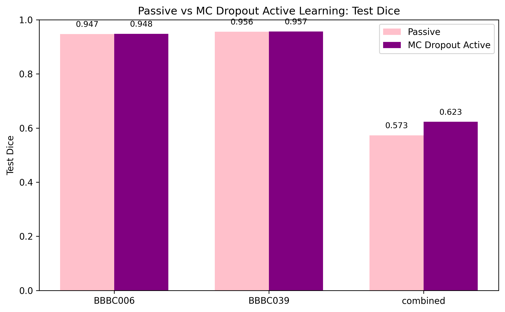
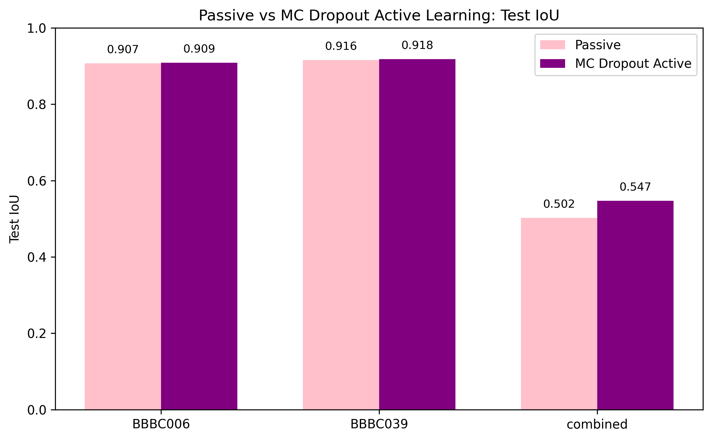

# Uncertainty-Guided Nuclei Segmentation

Active learning for scientific image segmentation under limited labeling budgets.

## Overview

This project compares passive sampling with uncertainty-guided active learning for nuclei segmentation in microscopy images. The task is formulated as a binary segmentation problem, using a U-Net architecture trained on paired image and mask data and selecting informative samples according to model uncertainty rather than random sampling alone.

The work addresses the practical question of how best to allocate a limited labeling budget when expert annotation is costly.

## Research Question

Can predictive uncertainty be used to select more informative microscopy images for labeling while maintaining strong segmentation performance?

## Datasets

The experiments use microscopy image sets from the Broad Bioimage Benchmark Collection, specifically:

- BBBC006
- BBBC039

These are the required source datasets for the project. The full dataset files are not committed to this GitHub repository and should be obtained separately from the Broad Bioimage Benchmark Collection for local execution.

## Method

The segmentation pipeline follows a standard supervised U-Net approach for binary nuclei masks:

- U-Net segmentation model
- BCE + Dice loss objective
- passive sampling baseline using random labeled-image selection
- MC-dropout uncertainty sampling to rank unlabeled images by predictive variance
- matched labeled-image budgets for active and passive comparison
- Dice and IoU evaluation on validation and test sets

The notebooks preserve the original experimental logic while keeping the shared training and evaluation code reusable through the project package in [src](src).

## Experiments

The maintained experiments in this repository are:

1. [notebooks/02_train_bbbc006.ipynb](notebooks/02_train_bbbc006.ipynb) — BBBC006 active vs passive comparison
2. [notebooks/03_train_bbbc039.ipynb](notebooks/03_train_bbbc039.ipynb) — BBBC039 active vs passive comparison
3. [notebooks/04_train_combined.ipynb](notebooks/04_train_combined.ipynb) — combined dataset comparison
4. [notebooks/05_downstream_analysis.ipynb](notebooks/05_downstream_analysis.ipynb) — final downstream comparison and summary

## Results

The recorded metrics used for the project summary are preserved in the saved output tables under [outputs/histories](outputs/histories). The final comparison values present in the project outputs are:

| Dataset | Passive Dice | Active Dice | Passive IoU | Active IoU |
| --- | ---: | ---: | ---: | ---: |
| BBBC006 | 0.947 | 0.948 | 0.907 | 0.909 |
| BBBC039 | 0.956 | 0.957 | 0.916 | 0.918 |
| Combined | 0.573 | 0.623 | 0.502 | 0.547 |

The comparison plots already present in [outputs/figures](outputs/figures) are embedded below.

These summaries should be interpreted within the scope described in [docs/limitations.md](docs/limitations.md).

## Repository Structure

- [notebooks](notebooks): maintained experiment notebooks
- [src](src): reusable project code for data handling, preprocessing, model components, loss, evaluation, and active learning utilities
- [outputs](outputs): saved training histories, comparison summaries, checkpoints, and figures
- [docs](docs): project methodology, limitations, and reproducibility notes
- [archive](archive): preserved exploratory material and provenance records
- [data](data): expected local dataset directory for BBBC006, BBBC039, and combined data as needed for local execution

## Reproducibility

This repository includes the dependency definitions for local setup:

- [environment.yml](environment.yml)
- [requirements.txt](requirements.txt)

The environment is intended to support the project code in a local Python installation, while the raw microscopy datasets themselves remain external to the repository and are not included in GitHub.

## Limitations

The project is best interpreted as a constrained experimental study rather than a broad claim of universal performance. The saved outputs support the recorded setup in this repository, including the matched labeling budget and the selected active-learning strategy. A more general claim about robustness across all datasets, seeds, budgets, or imaging domains would require additional experiments and statistical validation.

See [docs/limitations.md](docs/limitations.md) for the full scope and caveats.

## Technologies

Python, PyTorch, NumPy, pandas, scikit-learn, Pillow, tifffile, and Matplotlib.

## Authors / Academic Context

This project originated in an academic coursework setting and reflects a final project workflow focused on uncertainty-guided segmentation under limited labeling budgets. The repository retains the preserved artifacts, saved outputs, and project documentation without over-claiming beyond the recorded results.
